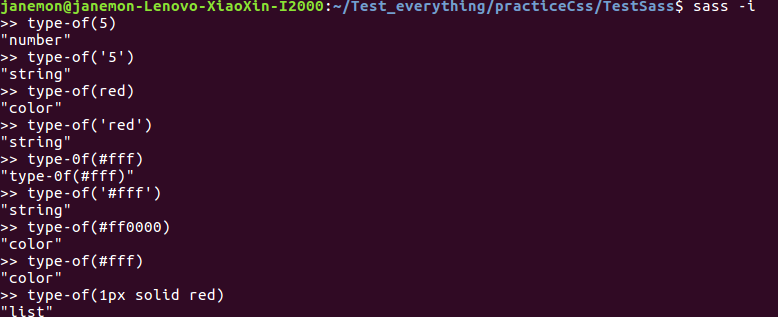
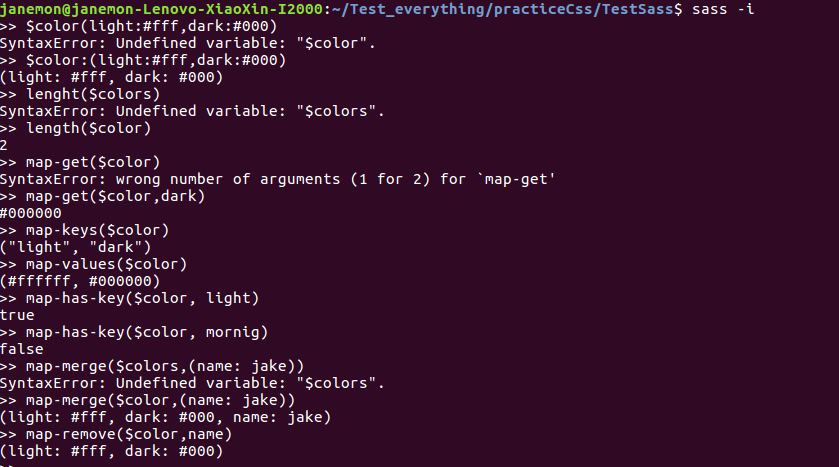
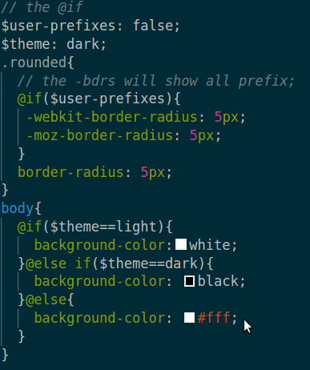
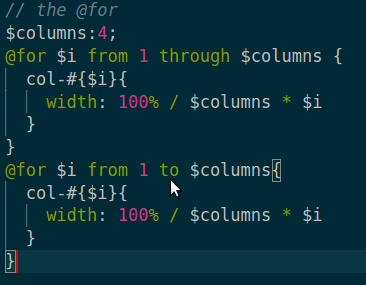
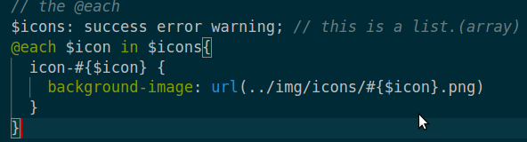
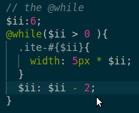
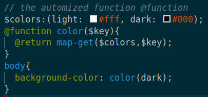
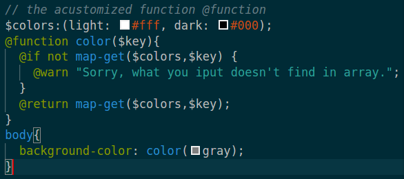

# the introduce of sass
1 the usage of command line of sass  
`sass (dir of scss's files)/(scss's file):(dir of css's files)/(css's file)`
`sass scss/style.scss:css/style.css`

--------------------------------------

2 To watch automatically the change  
`sass --watch scss:css`
`sass --watch scss/style.scss:css/style.css`

--------------------------------------

3 To output the special style of css  
`sass --watch scss:css --stlye expanded`

--------------------------------------

4 Actually, the <mark>.scss</mark> is the improved version of the .sass  

--------------------------------------

5 In scss, we define variables using the sign of "$" and here can be other variables in a variable.  
```
$primary-color: #fff;
$primary-border: 1px solid $primary-color;
```

--------------------------------------

6 In Sass, we can use the nest structure like other programming language.  
> *before*  
```
.nav{
  height: 200px;
  ul{
    margin:0;
    li{
      float:left;
      padding:5px;
      list-style:none;
    }
  }
}
```
> *after complied*  
```
.nav{
  height:200px;
}
.nav ul{
  margin:0; 
}
.nav ul li{
  float:left;
  padding:5px;
  list-style:none;
}
```

--------------------------------------

7 In sass, we use nest to express the descendant, but how do we just use(call) the parent not use descendant of parent?
*the follows both are different*  
>> 1 
```
.nav{
  height: 200px;
  ul{
    margin:0;
    li{
      float:left;
      padding:5px;
      list-style:none;
      :hover{
        font-size: 20px;     
      }
    }
  }
}
```
>> 2
```
.nav{
  height: 200px;
  ul{
    margin:0;
    li{
      float:left;
      padding:5px;
      list-style:none;
      &:hover{
        font-size:20px;     
      }
    }
    
  }
}
```
> the first one will show `.nav ul li :hover`, the second will show `.nav ul li:hover`. And the last one is just what we want! 
- *Interesting, we can use like this:* 
```
.nav{
  height: 200px;
  ul{
    margin:0;
    li{
      float:left;
      padding:5px;
      list-style:none;
    }
  }
  & &-text{
    font-size: 18px;   
  }
}
```
the above will become this: `.nav .nav-text{...}`

--------------------------------------

8 the nest of the property
```
.pp{    
  font:{
    family: Helson;
    size: 12px;
  }
}
```
*the above will show:*
```
.pp{
  font-family: Helson;
  font-size: 12px;
}
```
--------------------------------------

9 the important function of sass which is @mixin and it just like the function in other programming language. The usage of @mixin is follow:
- **define:**
> `@mixin name(parm1,parm2,...){...}`
- **usage:**
> `@include name`
- **Example**
```
@mixin alert{
  color: #fff;
  background-color: blue;
  a{
    color: red; 
  }
}

.alert-warning{
  @include alert;    
}
```
the above will show:
```
.alert-warning{
  color: #fff;
  background-color: blue;
}
.alert-warnig a{
  color: red;    
}
```

--------------------------------------

10 the paramater of the mixin
```
@mixin show($text-color,$bgcolor){
  color:$text-color;
  background-color: $bgcolor;
  a{
    color:darken($text-color, 10%);
  }
}
```
/*!
```
.show{
  @include show($bgcolor:#fff,$text-color:blue)
}
```
*/
```
.show{
  @include show(blue,#fff)
}
```

--------------------------------------

11 the important function os sass, which is <mark>@import</mark> and it's usage is to introduce other stylesheets but it will call a **http require** that will cost some resource, so the improved way is inventing a **partials** way which let sass **modularization**. Last we should note the partial files' fomat: it is beginnig with **'_'**.
> **the example**
- create a partial file: **_base.scss**
```
body{
  margin:0;
  padding:0;
}
```
- introduce the partial file: *_base.scss*
```
@import "base"
```

--------------------------------------

12 the inheritance: <mark>@extend</mark>which express the big brother has guys working for him, who not only has their boss's goods but have their own thing, so the little guys will have all involved their boss's good things.  
```
.alert{
  padding: 15px;    
}
.alert-info{
  @extend .alert;
  background-color: blue;
}
.alert a{
  font-weight:bold;    
}
```
which will show:
```
.alert, .alert-info{
  padding: 15px;    
}
.alert a, .alert-info a{
  font-weight:bold;    
}
.alert-info{
  background-color:blue;    
}
```

--------------------------------------

13 the <mark>type-of</mark> function of sass which show the data type in sass.  
  

**we have other functions in sasss, for example:**

- number type
> `abs()`,
>`round()`,
>`ceil()`,
>`floor()`,
>`percentage()`,
>`min()`,
>`max()`,

- string type
> `to-upper-case()`,
> `to-lower-case()`,
> `str-length()`,
> `str-index(string,character)`,
> `str-insert(string,index,character)`,

- color type
> `lighten(color-variable,percentage)`,
> `darken(...)`,....

--------------------------------------

14 the <mark>list</mark> type of the sass
> the list data type maybe like the array in other programming language. And the list is maked up of a series of values.  

**the example**
```
1. nth(5px 10px, 2) => 5px
2. index(1px solid red, solid) => 1
3. append(5px 10px, 5px) => (5px 10px 5px)
4. join(5px 10px, 5px 0) => (5px 10px 5px 0)
```

--------------------------------------

15 the <mark>map</mark> type of sass
> you know it just like the map of the data structure.   



--------------------------------------

16 **interpretation** of sass which can explain the meanig in everywhere. The format is <mark>#{...}</mark>
- **example:**
```
$version: "0.0.1"
/*the version of this system is #{version} */
$name: "info"
$attr: "border"
.alert-#{$name} {
  #{attr}-color:#ccc;
}
```
> which will show:
```
/*the version of this system is 0.0.1*/
.alert-info{
  attr-color:#ccc;
}
```

--------------------------------------

17 <mark>Control Directive</mark>
- example:
> 1 @if (condition){...}else if(cond){...}     



> 2 @for $iteration from number1 through(to) number2{...}   



**note**: the 'throught' is include  num2 but the 'to' doesn't include  num2.

> 3 @each $iteration in $list{...}   

  

> 4 @while(condition){....}   

  
**note** the '+' or '-' should be keep whitespace around it. 

> 5 the acustomized @function name (param){...}   

   

**And we can set the @warn to warn us:**



