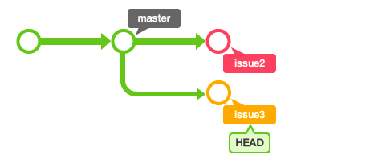

1 首先自己本地得有一个仓库
  `mkdir Test_git`
> 或者使用第二步的操作 (git init Test_git)
       
-------------------------

2 让git来管理你仓库里面的工程
  `git init`

-------------------------

3 创建你的工程.这里假设你的工程现在只做出一个 readme.txt 文件
  `vim reademe.txt`

-------------------------

4 把这个readme.txt 文件追踪起来(这是第一步,我们要做的版本控制当然是得把他添加进来git的控制中),添加到 working dictionary(另一些资料称为:Index)
  `git add .`
  (注意: 我们没修改一次都要add一下用于追踪)

-------------------------
         
5 检查情况
  `git status`
  
-------------------------

6 如果此时,你还想在修改一次的话,那么修改完后,可以查看前后有什么不同的地方
  `git diff`

-------------------------

7 最后,如果确认无误后,我们就可以真正地去保存他了(Head).
  `git commit -m 'des'`

-------------------------

8 当然如果我们是团队开发的话,那么我们必须建一个中心仓库来管理整个团队的工程项目.
> 所以我们得链接上这个远端的中心仓库(提交到远程github 上的仓库, 你也得要在上面有才行啊 #_#!).  

`git remote add origin referenced-address`
> remote add 表示了和本地的 add有所不同  

<mark>NOTE:</mark>  
当然有些时候我们是直接在github上直接clone 那个中心仓库的工程项目,而不用自己建一个.
  `git clone referenced address`

-------------------------

9 那么和remote链接上了之后,我们可能被分配创建一个新的分支
       `git branch branch_name`
 
-------------------------

10 如果我们想要切换到另一个分支的时候那么我们可以这样做:
        `git checkout otherBranch_name`

 -------------------------

11 当我们完成了自己所完成的功能时候,我们就要把他提交到中心仓库上了
        `git push origin<1> master<2>`
> 1 假设是提交到remote的分支,默认是主机上的master)  
> 2 假设是当前要提交的分支,默认的也是这个  

    
    
  
<mark>NOTE:</mark> 有时候这个分支(可能是master也可能是branch)与多个主机存在追踪关系,可以用 -u 选项指定一个默认的主机, 这样后面就不用加任何参数了  
   `git push -u origin master`  
> 这个时候需要提交密码.  

-------------------------

12 查看当前有那些remote链接:
        `git remote -v`

-------------------------

13 如果我们提交上去的branch已经被管理者所merge了,那么我们可以在本地上merge该分支,然后删除这个已经merge 的分支,如果可以顺便把remote的该分支也删了.
        `git checkout master(假设是主分支)`
        `git merge required_branch`
        `git branch -d required_branch`
        `git push origin(假设是远端的主分支) --delete required_branch`

-------------------------

14 当然不止你一个在打理一个分支功能,那么你也要吧别人的修改的东西拉到自己的本地分支了:  
        `git pull origin request_branch`  
> 1 如果就是合并到这个分支的话,那就不用再打名字了, 其实如果出来工作了的话, 这是不是经常做的事  
> 2 如何你在之前已经设定了默认主机,那么根据情况, 你可以像 'git push' 那样直接: `git pull`

-------------------------

15 如何我们想删除每个文件, 我们可以  
        'git rm file_name`  
> 1 其实直接在工作区中 `rm ...` 那么什么都 over了  
> 2 这样就把文件从git仓库中删除了(也就是说不再被git追踪了), 并且连工作区中的文件也一并删除了  
> 3 如果我们只想把他从git仓库中删除但是不在工作区内删除的话,  
        `git rm --cached file_name`  
    Note: 最后,我们如果想要在github上也一并删除的话那么就得要 'git commit -> git push'

-------------------------

16 如何我们想要重命名,那么 status 会显示出这样的操作吗?  
        `git mv olafilename new filename`  
   答案是: 会的

-------------------------

17 如果我们想要查看提交的日记,我们可以  
        `git log`  
    如果我们想要查看提交的内容差异:  
        `git log -p`  

-------------------------

<mark>NOTE:</mark>
1. 我们知道在git下有三个区:  
首先, 是我们的**暂存区(Index)** 这是我们 **'git add'** 后的区  
其次, 是我们的**完成区(Head)** 这是我们 **'git commit'** 后的最终区  
最后, 是我们的**工作区**, 就是我们实际上操作的区域但没有被git跟踪,换句话来说其实他和git没有什么关系.  

2. **`git config --list`** 
    这个是查看配置信息的  
      

3. **`.gitignore`**
    这个是在git中可被忽略的文件:  
>> 1 '#' 表示注释  
>> 2 '/' 表示这个忽略的是目录  

4. **git status** 是仅仅显示了那些文件做了修改, 有没有被 add 或者 commit,  
   而**git diff** 这是显示了那些还没被add的文件做了什么样的修改,  
   而**git diff --staged/--cached**这是显示了还在暂存区和上次提交的区别,做了那些修改.  

5. **`git commit -a -m'...'`**  
   是可以不用'add' 就可直接提交file了.But the file must be 'add' before  

6. 如果想要知道如何设置SSh秘钥, 上网搜索吧!  

-------------------------

18 换行: 在行末加两个空格键和一个回车键. (<c-Enter>)
    分段: 段落之间空一段

-------------------------

19 如何解决冲突, 选择一个你真正想修改的而放弃另一个.  
  
  
  
如我们看到的, 在 `========` 上方的是我们当前仓库所在与远程仓库同一行的修改, 那么下方当然是远程仓库的修改咯.  

-------------------------

20 I don't know???  
  

-------------------------

21 现在, 让我们来谈谈关于分支合并和处理冲突的东西吧:  
> 1 正如前面所说, 我们可以通过 `branch` 命令来创建分支, eg: `git branch issue1`. 如果我们不指定参数而执行的话, 那么他就会显示分支列表.  

> 2 切换分支, 也如之前所说的, 可以用到`checkout`, `git checkout issue1`. 不过值得注意的是, 我们如果切换到那个工作区工作, 那么我们的 **Head**(用我自己的话来说这个是**完成区**), 就在那个分区.  

> 3 如果我们切换到了issue1中, 并且有内容提交了. 那么流程图是这样的:  
      

> 4 如果我们想合并分支了, 那个我们可以使用`merge`, 先切换到 `master` 分支,确认一下内容是否已经合并了, 没有的话, 那么我们就可以合并他,eg: `git merge issue`  
      
完成之后, 打开文档, 确认内容是否已经更改.如果更改了的话, 你又不再需要这个分支, 那个可以把他delete: `git branch -d <branchname>`.  

> 5 假如我们多个分支进行工作的话, 那么可能会出现以下情况:  
      
      
      
我们开始可以合并issue2, 但是合并issue3就会出现冲突, 那么就是说有某处这两个分支是做出了不同的修改.  
      
      
      
那么做出了修改之后, 解决冲突部分, 重新提交, 比如像这样:  
      
上面这种是其中一种合并分支的方法, 但是这种合并分支的方法, 会让历史记录看起来有点乱啊(但是我觉得挺好的啊), 接下来介绍第二种方法:  
>> 1   
 
>> 2 比如,现在我们回到`issue3`, 并把它合并到 `master`上.=> `git checkout issue3`, `git rebase master`, 此时我们就像上面那种方法一样, 冲突依旧存在, 我们像之前一样, 修改内容就行.  

>> 3 最后, 把修改过后的文件 `add` 好, 并且将rebase进行到底: `git rebase --continue`  
     
   
>> 4 最后, 尽管这个合并主要都是在分支上进行, 但是我们最后还是得要回到master上进行合并: `git checkout master`, `git merge issue3`  
        

<mark>最后, 总结两个办法的不同:</mark>  
> 1 **_第一种_**: 我觉得操作比较直观而且历史记录比较详细,但是多过头的话, 这种方法就会显得记录的比较'复杂难看'. 这种方法:**全部操作都是在master上进行的**  

> 2 **_第二种_**: 这种的话操作如果你懂的话也是比较简单直观的, 相比上一种方法, 他的记录不会那么详细, 因为最后他都不会记录分支的'路径记录', 但是这样在流程图上就看起来比较直观, 即使是多个分支时, 也一样.这种方法:**他的前期操作都是在分支上, 到最后需要合并的时候才会回到master**.  

-------------------------

22 现阶段我们一般是使用 `pull` 来更新数据, 但是其实如果说安全一点还是用 `fetch` 比较好. 因为 **fetch** 他是不会**自动合并**的, 你可以在merge前, 查看更新情况, 然后在决定是否合并, 当然 **pull**也有他的好处, 就是比较方便和省事.  

-------------------------

