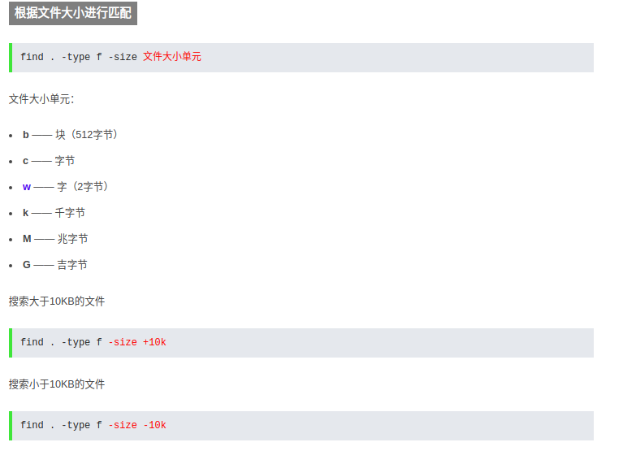
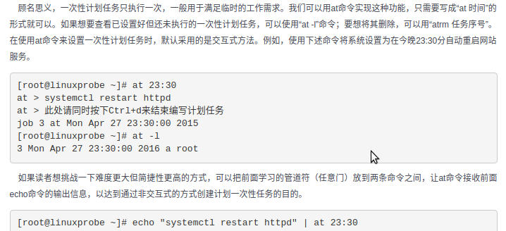

<mark>the unix philosophy is **Small is beautiful** or **less is more**</mark>

1. 为什么会有逻辑卷管理器(logical volume manager)?
> 物理磁盘（顾名思义）  

> 虚拟磁盘（使用RAID技术或者其他技术组合的多个物理磁盘组成的虚拟磁盘）  

> 虚拟磁盘可以在逻辑上再次进行划分，划分出的磁盘称为逻辑磁盘。(划分后的这100G大小的逻辑磁盘，可能并不一定位于同一块物理磁盘上，它可能各占了每个磁盘的25G，又或者各占了其中两个硬盘的50G，也就是说它可能是跨多个物理磁盘的，这样提高了IO效率。)  

> 分区（和逻辑磁盘并不是一个概念, 这是一个用户自己的重装系统的操作，在这之前逻辑磁盘已经分完了）（OS会认为自己看到的就是一个物理磁盘（而不管它实际可能是一个逻辑磁盘），在此基础上，操作系统可以对这个自己看到的物理磁盘（实际上可能是逻辑磁盘）进行分区、格式化等操作）[Windows分区时必须有一个主分区，或者一个主分区一个扩展分区（就是一块硬盘分成了主分区和扩展分区），当处于后者时，我们又可以把扩展分区分成多个逻辑分区（也就是我们常见的D、E、F盘）]  

他是Linux环境下**对磁盘分区进行管理**的一种机制，LVM是建立在**硬盘和分区**上的一个逻辑层，来提高磁盘分区管理的灵活性。通过LVM系统管理员可以轻松管理磁盘分区，如：将若干个磁盘分区连接为一个整块的卷组(volume group) 形成一个存储池。管理员可以在卷组上随意创建逻辑卷组(logical volumes)并进一步在逻辑卷组上创建文件系统.管理员通过LVM可以方便的调整存储卷组的大小，并且可以对磁盘存储按照组的方式进行命名、管理和分配，例如按照使用用途进行定义：“development”和“sales”，而不是使用物理磁盘名“sda”和“sdb”。而且当系统添加了新的磁盘，通过LVM管理员就不必将磁盘的文件移动到新的磁盘上以充分利用新的存储空间，而是直接扩展文件系统跨越磁盘即可。  
> PV(VM将操作系统识别到的物理磁盘或者RAID提交上来的逻辑磁盘改了个名字，称为PV。物理卷是分区或者硬盘在LVM结构下“转化”的结果，和分区、磁盘等（我们称之为基本的物理存储介质）的不同之处在于包含有与LVM相关的管理参数。)  

> VG(volume group 多个物理卷可以被逻辑的放在一个组中，称为卷组，卷组是一个虚拟的大存储空间，逻辑上是连续的，卷组会将所有的物理卷首尾相连，组成一个逻辑上连续编址的大存储池。)  

> LV(LVM的逻辑卷类似于非LVM系统中的硬盘分区，在逻辑卷之上可以建立文件系统(比如/home或者/usr等)。)[生成的逻辑卷，在主机看来还是和普通磁盘一样，可以对其进行分区、格式化等。逻辑卷和前面的逻辑磁盘的一个区别是，逻辑磁盘的容量划分完成后，不好改变大小，而逻辑卷的容量可以随时进行改变。]

2. __/__ 和 __?__ 分别是正向搜索和反向搜索.

3. top命令:  

4. ifconfig 和 Windows的 ipconfig 一样.

5. uname => knel and linux version.
> 如果想查看系统的发行版本只能用 `lsb_release -a`, 这个最多只能看处理器类型和主机名（不是用户名）[order: 29]

6. free 内存使用量

7. who 接入用户都是谁

8. history 历史上使用的命令  
     可用 !行号 来执行该行号的命令

9. cat 查看文件内容,适合较少内容的
10. more 查看文件内容,适合较多内容的
11. head -n ... 查看文件头几行的内容
12. tail -n ... 查看文件后几行的内容

13. stat 查看文件的相关信息  
> 可以显示大小，块数，链接，权限，属主，最主要的还是时间戳：文件的访问时间，文件的修改时间，文件的权限修改时间（文件的创建时间,在权限从未更改过的前提下）  

<mark>NOTE:</mark> 有个命令是 `file` 但是这个是显示文件类型的，而不像 `stat` 这样会包含那么多的信息.

14. 在文件的每行截取指定字符, 通过 -b/-c(字符而不是字节)/-f.其实看去来没什么用但是'存在即是真理'. 比如: 截取passw文件的第一个用户, 用cut就特别方便.  
  
  

<mark>注意：</mark> 现在我们可以知道，对文件的行我们可以用 `head` or `tail`。对行里面我们可以用 `cut`  

15. diff 查看文件(是两个不同的文件)的不同, 单单是查看的方式就有三种: diff file1 file2 | diff -c file1 file2 | diff -u file1 file2 (当然是合并版最好,'git' 就采取了这种方式)  
  
'+' and '-' 都是对应改变, 但是'-' 对应的是第一个文件, 而加对应的是第二个文件的改变, 或许仅仅是一个字不同而已,并不是代表就是加一行或者减一行.  

16. mkdir -p .... 可创建层叠文件夹: `mkdir -p parent/{a,b,c}`  

17. dd 按照指定大小和个数的数据块来复制文件或者转换文件  
  
  

18. tar -xzvf ... -C ....  
      解压(为tar.gzip),过程,源文件,目标地址
    tar -czvf ... -C ....  
      压缩(为tar.gzip),过程,源文件,目标地址

    gzip -d ...  
      解压(decompress, 为 .gz格式), 源文件
    gzip ...  
      压缩，源文件

    bzip2 -d ...  
      解压(为bz2格式), 源文件
    bzip2 -z ...  
      压缩，源文件

    unzip ...  
      解压（格式为zip），源文件
    zip -r ... file.zip  
      压缩，递归，源文件(为目录), 目标文件(压缩后)

> 格式为这样的：`tar.zip`和`tar.gz`之类的，第一个为 tar 打包不是压缩，而后面的才是压缩，而且要注意一个重要更新 tar 从1.15版本后就可以自动识别压缩的格式，不再需要人为区分压缩格式就能正确解压, 所以一切tar包的解压都可以用`tar -xvf`  

19. /etc/passwd 保存着所有用户信息

20. grep 查询字符 被查询文件(可以是多个)  
      -n 这个是显示字符所在的行数  
      -i 忽略文字大小写  
      -v 参数是那么代表反选  
      -c 统计出符合的行数(列数)  
      -E "..." 使用正则  
      -r 可对目录使用递归  
      -A number, 显示匹配字符的下面(对文字来说，下面的确是前进的方向)几行内容  
      -B number, 显示匹配字符上面几行的内容  
      -C number, 显示匹配字符前后几行的内容  
      -l 列出包含查询字符的文件名（在多个查询文件中）  
      -e 匹配多个查询字符  
      -f 我们可以创建一个查询模式文件，通过这个文件来进行查询文件中内容  
<mark>注意：</mark>  
> `grep`查询的是文件内容，而下面的`find`是查文件本身。  
>  查找文件中的所有空行：`grep ^$ file -n`  

21. find 文件 'linux中可是一切都是文件哦'.  
  
> 其实一开始我是搞不清`whereis` and `which` has what differences. but now i understand it. Yep, it have something same and also have some differences.
>> 1 `whereis` 是仅仅用于程序名(有些程序名也是命令)的搜索, 而且搜索三种类型的文件, -m(man instruction) -b(the binary file) -s(the source code)  
>> 2 `which` 是仅仅搜索命令的, 但是他只返回搜索结果的第一个.  

 所以啊, 经过以上的解析就让我们开始进入 <mark>find</mark> 的世界吧:  
 **find 'directory' 'option'**  
 _(if we dont' aim the special directory, by default, the command will use the current directory and it's subset)_  
> 1 **-name "file"**, means what format files we want to find. __eg: find . -name "*.txt"__  

> 2 **!** , means find file not in this condition. __eg: find . ! -name "*.txt"__  

> 3 **-o** , means we execute the other command in the same time. __eg: find . -name "*.txt" -o -name "*.pdf"__  

> 4 **-regex** , means using regex to find file. __eg: find . -regex ".*\(\.txt\|\.pdf\)$"__  

> 5 **-type ...(f, d, l, c, b, s, p)**, means find what type of file we want to find. __eg: find . -type f -name "*.txt"__  

> 6 **-atime/-amin**, means the user last acess time, __eg:__  
>> 1 **find . -type f -atime -7**, the __-__ sign means among this number's day.  
>> 2 **find . -type f -atime 7**, no sign before number means just before this number's day.  
>> 3 **find . -type f -atime +7**, the __+__ sign means beyond this number's day.  

> 7 **-mtime/-ammin**, means the user last modify the file's content.  

> 8 **-ctime/-cmin**, means the user last chage the file's satation.  

>   

> 10 **-delete** , means delete the file meatched. __eg: find . -type f "*.txt" -delete__  

> 11 **-perm(-permission)**, means find the file accoding to it's access. __eg: find . -type f -type f -name "*.txt" -perm 777__  

> 12 **-user/-group**, means find the file owned of which user or group. __eg: find . -type f -user tom / find . -type f -group sunk__  

> 13 **-path ".." -prune**, means find some file but prune this directory. __eg: find . -pat "./sk" -prune -o -type f -name "*.txt"__  

> 14 **-exec ... {} \;** , note that every charatcer in sign of '**' is should be need, the '{}' actually is the form parameter which present every files of matched, and '\' and ';' are neccesary for it. This command can execute somet motion after find the matched files. <mark>eg:</mark> `find . -name "*.txt" -exec rm {} \;`.  **Actually, we can use <mark>-ok </mark> to replace it beacuse it will show the prompt which show more security.值得注意的是，只能用在 `\;` 这种情况下**  

----------------------------------------------

<mark>NOTE:</mark> 我们知道 linux命令可以从两个地方读取要处理的内容, 一个是通过命令行**参数**, 另一个是标准输入.  
_eg:_ `echo 'main' | cat test.cpp`  _result:_ show the content of test.cpp, if no exit this file, it also can't show the 'main'. 正常来讲, `echo 'mina'` 会通过管道符 将其的**标准输出** 导入到 cat 的**标准输入**中, 也就是说,此时 cat 的标准输入中是有内容的. 但是他却不从标准输入中读入要处理的内容, 因为他优先从命令行参数中读取数据, 而且有一些命令他是不处理**标准输入**的. _eg_: `echo '516' | kill`. 这个是不能执行的.  
那么就引申到这个可以 **把文件内容分割为命令行参数的命令**: <mark>xargs</mark>  
> 有时候我们的脚本却需要 echo '516' | kill 这样的效果，例如 **ps -ef | grep 'ddd' | kill** 这样的效果，筛选出符合某条件的进程pid然后结束。这种需求对于我们来说是理所当然而且是很常见的，那么应该怎样达到这样的效果呢。有几个解决办法：  
> 1 通过 **kill ps -ef | grep 'ddd'**    
> 这种形式，这个时候实际上等同于拼接字符串得到的命令，其效果类似于  kill $pid  

> 2 **for procid in $(ps -aux | grep "some search" | awk '{print $2}'); do kill -9 $procid; done**   
> 其实与第一种原理一样，只不过需要多次kill的时候是循环处理的，每次处理一个 

> 3 <mark>**ps -ef | grep 'ddd' | xargs kill**</mark>  
> OK，使用了xargs命令，铺垫了这么久终于铺到了主题上。**xargs命令可以通过管道接受字符串，并将接收到的字符串通过空格分割成许多参数(默认情况下是通过空格分割) 然后将参数传递给其后面的命令，作为后面命令的命令行参数**  

所以, 一切大白, 我们要学习的一个命令是 <mark>xargs</mark>  
xargs命令是给其他命令传递参数的一个过滤器，也是组合多个命令的一个工具。它擅长将标准输入数据转换成命令行参数，xargs能够处理管道或者stdin并将其转换成特定命令的命令参数.  
  
> 值得注意的是 **xargs** 是默认以空格作为分隔符来进行参数的分隔  
> -d 指定参数分隔的分隔符； -n 每次处理参数个数，不写则是不做处理直接文件为一个参数

这里值得注意的是, xargs 必须和其他命令一起执行的(我主要用在 find 上), 因为他的作用就是为了使其他东西转换成命令行参数, xargs 是要放在需要参数的命令行前面.  
这里有一个和 find 命令里面的一个 **-exec**, 有点类似的地方, 就是 **对应替换** `{}`, 但是我们另外增加一个 `I` 和 减少一个 `;`.  
1 _eg:_ **`ls *.jpg | xargs -n1 -I {} cp {} /data/images`**  
2 _eg:_ 用rm 删除太多的文件时候，可能得到一个错误信息：/bin/rm Argument list too long. 用xargs去避免这个问题：  
  **`find . -type f -name "*.log" -print0 | xargs -0 rm -f` => `find . -type f -name "*.log" | xargs -n1 -I {} rm -f {}`**  
  

> 所以总结出来 **xargs**最重要的参数分别是 `-n, -d, -I({}), -t, -p`  

----------------------------------------------

22. pidof name 查找改该进程的id
> -s 返回以进程号  
> -c 仅显示具有相同“root”目录的进程

23. kill id 结束进程

24. <mark>每个基于文本的程序都应该能够从**任何源**接受输入,并向任何**目标**写入输出</mark> 
> 以这种方式处理I/O, 用户具有极大的灵活性,而且对于Linux来说, 他把处理输入和输出交给了Unix来处理, 这就意味着用户不必担心输入和输出的各种情况了. 所以,Unix的开发人员设计了一种读取数据和两种写出数据的通用方法. 在登录时, shell会自动地将标准输入设置成键盘(或许你可以这样想,除了从指定文件读入外,其他的都可以不是标准输入)将标准输出和标准错误设置为屏幕.  

输入重定向: 从文件中输入，也就是说把文件导入命令(一般是直接在命令后面跟文件)[多用于组合命令中]( "<"  就如C++ 一样的输入方向)  
输出重定向: 把原本输出屏幕的数据信息写入到指定文件中显示  
标准输入(STDIN, 文件描述符为0)：默认是从键盘输入  
标准输出(STDOUT，文件描述符为1)：默认输出到屏幕  
标准错误输出(STDERR，文件描述符为1)：默认输出到屏幕  

  
  
<mark>note:</mark>  
1.因为当重定向输出时, 如果如果 一不小心 '>' 覆盖了原本的内容, 那么就糟糕了,所以我们可以做一些防护措施: 对于Bash CLI 来说, 是这样 `set -o noclobber`, 然后, 当确定要重定向时, 使用 '>|'.  

25.  

26. alias :创建属于自己的命令别名
      比如: alias rm='rm -i' 解决了困扰我多年的rm 不小心操作后的问题.
note: PATH变量的作用是, 设定解析器搜索所执行命令的路径.

27. env :查看我们的环境变量(有时候, 环境标量仅仅是指PATH, 这个可以在任何位置启动程序的变量,里面写着各种程序的执行路径)  
      
    

28. | : 管道符把左面（前面）命令的输出值作为右面（后面）命令的输入值以便进一步处理信息。
    
29. lsb_release -a :查看Linux是那个系统

30.   
      
    
**NOTE:** 
 1. 参数如同上面所示,通过空格来隔开.  
 2. 如果通过输入完整路径来运行脚本的话,那么大多数会显示权限不足,此时需要增加权限. 比如:  
 3. 这里的变量是不需要声明的，约定成俗，变量全用大写，并且引用的时候前面加上‘$'.  
  

31. shell 脚本的测试语句和之前接触的有些不同,他是这样的: [ 条件表达式 ] _条件表达式左右都需应有一个空格, 其实shell是一种严格按照规范的语言._而且要理解他要<mark>结合类unix来发挥他的作用</mark>  
**NOTE:**
 1. 按照测试对象来划分,条件测试语句可以分4种:  
> - 文件测试语句
> - 逻辑测试语句
> - 整数值比较语句
> - 字符串比较语句  
>> 1.  
>> 2.  
>> 3.  
>> 4.  

> 需要注意的是这些条件放的位置： `-e` 是放在文件名前面，而 `-ge` 就放在文件名后面  
> `&&`我理解为“连”，前面为真时执行后面的命令；`||`我理解为“跳”，前面为假时执行后面的命令  
 2. **$?** 可以显示上一条命令执行后的返回值, 其实如果在脚本中,那么上一条语句执行过后,那么它也就可以说是上一条命令了.
 3. shell 脚本中的条件测试语句, 如果成功那么它返回的值是 **0**, failed, 则返回其他任何值.

32. shell 脚本的流程控制语句:  
> 1.   
>>     
> 2.   
> 3.   
> 4.   
> 5.   
>>   while循环语句的条件和for的不一样, for的往往是已经知道循环次数了,而while并不确定, 简单来说就是for 的 使用情景更加具体.
> 6.   
> 7.   
> 8.  

<mark>NOTE:</mark>  
- shell 脚本只需要对变量名全大写就行了, 而不需要一个定义符  
- shell 脚本不需要对在结尾对语句进行 ';', 除非把那些下一行的语句全都写作同一行，比如：`if [ -e readme.txt ] ; then .....; fi;`
- shell 中, $(...) 和 `...` 是一样的.
- shell 中, /dev/null 是个信息黑洞,相当与'回收站'

33. linux中的用户:
> 1. 管理员: Linux的管理员是 root, 为什么是 root呢? 是因为管理员的UID=0, 而不是因为他叫root, root只是一个名称而已.  
> 2. 系统用户: UID为1~999, 为什么会有那么多呢? linux系统为了防止某个服务程序出现漏洞而被黑客提权到整个服务器,**默认服务程序会有独立的系统用户负责运行,进而有效控制破坏的范围**  
> 3. 普通用户: UID从1000开始! 其是由管理员创建的用于日常工作的用户  
**NOTE:** UID->User Identification, 具有唯一性.  

34. 为了方便管理一组用户, Linux 引入了用户组的概念. 通过使用GID(Group Identification) 用户组号码,把多个用户加入到同一个组中, 从而方便组中用户的统一规划权限或指定任务. 
**NOTE:** Linux 在创建每个用户时, 都会自动创建一个同名的用户组, 而且这个基本用户组就只有该用户一个人. 如果该用户被以后纳入其它用户组, 则这个其它用户组被称为扩展用户组. 一个用户只有一个基本用户组, 而可以有多个扩展用户组.  

35.   
需要注意的是其中 `-e` and `-s` which one is expried-time and the other is shell explainer.  

36.   
其中, 需要注意的是'一切皆是文件', 所以添加用户实际上就是修改配置文件的过程. 用户信息都保存在 /etc/passwd 中, /etc/shadow 才是加密的密码信息 :).  
      

37.   
需要注意的是, 我们可以利用 `-l` and `-u` to lock and unlock the user.  

38.   
需要注意的是, 在生产环境中单纯的设置文件的**rwx** 权限是无法满足安全性和灵活性的要求, 所以便有了 **suid, sgui, sbit**这样的特殊权限位.如果有了这个权限, 会增加一个**s**, 而且这个仅仅是对**二进制文件**有效.  

      
      
Here, we should note that, the first usage of sguid is we can give the user who is executing this file an access of the file's owner. 但是第二个作用似乎更常用些, 我们设置一个共享组目录, 而组内任何人员创建的文件都不会归他自己的用户组了而是现在这个共享组.  

39.   
需要注意, **sbit** 特殊权限是为了不让共享目录内的文件被恶意删除(一个文件能否被删除, 不是看他自己的权限而是看他所在目录的权限), 如果一个目录被设置成了**sbit**, 那么我们可以通过 `ls -l` 看到权限里面有个 **t/T**. 我们可以通过 `chmod -R o+t` 来设置'sbit', 这个 'R' 是代表递归的意思.   

40.   

41.   

42.   
      
   我觉得这是一个非常重要的且cool的命令, 如果用 `ls` 命令是看不出隐藏的权限的, 所以我们可以用 `lsattr` 来查看命令  

      

43.   
      
      
      
需要注意, 我们为什么需要 **setfacl**, 明明都有了 **chmod and chattr**, 问得好! **存在即合理**, 我们的确有了前两个命令可以做大部分工作了, 但是 就如社会发展到现在, 越来越多的**定制化**. 其实类比这个, **setfacl** 就是定制化: 比如, 你想把某个文件仅仅是设置成你和你的一个好友看, 你用上面的两个命令是做不到的. 想想,是不是真的做不到? 因为权限只有两个有, 而上面的命令权限设置, 只有是用户一个人的, 而其他的是则是 用户组 和 其他人, 如果我们给其他人设置了, 那么是这个其他人是不仅仅只有 你的好友一个人. 所以就有了 `setfacl` 的出现.  
**规则:**  
1 模板 => **`user:who(if no specify this will be nothing):permission`** eg: `_user::rwx_`. 接下来的 **group, mask, other** 都是这种套路.  
2 ACL_USER_OBJ and ACL_GROUP_OBJ are both point that the owner not the other user and group, the ACL_USER and ACL_GROUP even point that. 现在我们还要知道 **MASK** 代表遮盖, 这个代表了 当前用户,当前用户组和 其他用户的**最大值**, 注意了是最大值, 就是表明不一定是这个值, 他原本是什么的值就是什么值, 只不过这个 MASK 出来了有点 **蒙蔽** 的意思, 所以我们要想知道确切是什么值, 就必须用 `getfacl` 来查看. 注意有 ACL 设置的, 在 `ls -l` 结果后面会有一个 **+**.  

<mark>**特殊权限, 隐藏权限, 权限表的差异**</mark>  
> 1 特殊权限, 是仅仅针对二进制文件, 其中的 SGUID and SBIT 可以针对目录, 作用是: 可以给每个用户,或者某个组 暂时拥有 管理员的权限, 他主要针对的是用户而不是文件,当然他的设置是在文件上. 用法: **`chmod who+s file`** **`chomod who+t file`** and **SUID:4 SGID:2 SBIT:1**  
> 2 隐藏权限, 可以对文件/目录,目录进行隐秘的设置, 比如不能修改内容;只能追加内容: 删除文件后还有备份; 他这个不同 特殊权限, 是针对的是文件而不是用户. 用法: **`chattr +/- parameter file`**  
> 3 权限表, 我的感觉是这个是针对 特殊权限的improved version, 因为他把把单独一个用户领出来, 而不是只能对所有用户. 用法: **`setfacl user/group/mask:special point:permission`**  

44.  
  
  
  
> 其实, 这个拓展分区是其中一个主分区, 为了拓展而成的拓展分区:).  
> 再次, 我们需要弄清两个概念, 一是 **sda** 中的 `a` 不是所谓的第一个插槽上的存储储备, 这里的 a 是由系统内核识别的顺序决定的. 比如, 你插在第二个插槽, 这里也是 sda. 二是, **sda1** 中的 `1` 不一定是第一个分区, 因为这也可以是自己分配的.  

  
  
  

45.
**linux 发行版**  
需要指出的是，Linux 并不是一个完整的系统，它只是内核。没有内核系统不能运行，什么都干不了；但只有内核还是什么都干不了，一个完整的系统，是包含内核在内的一系列软件工具包
开源运动由许多独立的软件项目构成，如果最终用户需要自行获取这些软件包，然后把它们组装起来，成为可以运行的系统，就会浪费很多时间；而且组装一个系统并不是一件容易的事情，恐怕大多数用户无法作到。
于是出现了一些组织或个人，将内核和其它软件组装在一起，作为一个完整的系统发布，这就是发行版。安装大多数发行版，如 ubuntu、archlinux，就是通过安装程序，将已经组装起来的系统安装到计算机上

  

46.
1  你看看那些高水平的学术杂志，论文，那些大学教授的网页，那些漂亮的幻灯片，它们是什么做的？原来 UNIX 用户早就有非常方便的 troff, LaTeX, SGML 等东西可以处理文档，而且它们比起 Word 都要高明的多。我不用 Word 这样的程序写论文，而是用 LaTeX，因为这是世界上效果最好，最方便的论文工具，是大多数学术杂志要求的格式。幻灯都是用 ConTeXt 做的，用起来很简单，而且效果非常漂亮。

2  为什么 UNIX 程序员不用 IDE？明白了这个道理你就能体会到 UNIX 的设计思想了。首先，一个 IDE 集成了编辑器，编译器，汇编器，调试器，跟踪器…… 这个编辑器功能肯定比不上 VIM 或 Emacs，编译器比不上 GCC，汇编器比不上 as，调试器比不上 gdb, ddd, 跟踪器比不上 strace, ltrace, truss。你得到的是一套整合的低能的程序。

3  首先我们需要知道，硬盘分区的存在，是由硬盘的物理特性决定的，并不会因为操作系统的不同而有所改变。  
<mark>我倒是觉得，分区不过是一种资料整理的必然</mark>
请您把一块硬盘想象为一本书……即便您不喜欢读书，您也一定非常熟悉它，所有的书都是相同的，包括我们使用的课本……您肯定非常熟悉  
一本完整的书，通常包括书名、目录和正文。  
如果您需要Linux，您首先需要找到一本书名为《linux》的书，书名相当于硬盘中的MBR，也就是主引导纪录。不同的是，MBR可以是几个书名合在一起，类似于《XX合订本》。这部分内容暂时还没有什么实用价值，您只需要大概的了解。  
而正文，就是硬盘中纪录的数据，这也非常容易理解，且对于安装系统并没有什么影响，所以现在我们来了解目录:  
目录相当于硬盘中的分区表，书中的每一个章节，相当于硬盘中的一个分区，它起始和结束的页次，都可以在目录中找到。试想，如果阅读一本撕掉目录的书，您将很难找到您想阅读的部分。同样，如果没有分区表，操作系统也不能够在硬盘上定位数据的位置。  
由于历史的原因，硬盘中的分区表大小受到了限制，最多只可以容纳四个分区（主分区）。如果一本书，它的目录最多只能有四个章节，那不是太可怕了么？很多书的内容远远不止四个章节啊！  
于是聪明的人们想到了一个变通的办法，就是利用其中的一个章节，来存储其它部分的目录。比如第一章是前言，第二章是其它部分的目录，我们翻到第二章，呵呵，这里是第二个目录，因为只有第一个目录受四个章节的限制，所以这个目录的内容可以非常的详尽。第二个目录就是分区表中的扩展分区了，其中定义的章节，就是硬盘中的逻辑分区，不是很难理解吧？  

4 1965年时，贝尔实验室(Bell Labs)加入一项由奇异电子(General Electric)和麻省理工学院(MIT)合作的计画；该计画要建立一套多使用者、多任务、多层次(multi-user、multi- processor、multi-level)的MULTICS操作系统。直到1969年，因MULTICS计画的工作进度太慢，该计画就被停了下来。当时，**Ken Thompson**（后被称为Unix之父）已经有一个称为「星际旅行」的程序在GE-635的机器上跑，但是反应非常的慢，正巧也被他发现了一部被闲置的 PDP-7(Digital的主机)，Ken Thompson和**Dernis Ritchie**就将「星际旅行」的程序移植到PDP-7上。而这部PDP-7就此在整个计算机历史上留下了芳名。
<mark>MULTICS 其实是"MULTiplexed Information and Computing System"的缩写，在1970年时，那部PDP-7却只能支持两个使用者，当时，Brian Kernighan 就开玩笑地戏称他们的系统其实是："UNiplexed Information and Computing System"，缩写为"UNICS"，</mark>后来，大家取其谐音，就称其为"Unix"了。1970年可称为是Unix元年。

5 UNIX的历史开始于1969年ken Thompson，Dennis Ritchie（即著名的K&G，C语言的发明人）与一群人在一部PDP-7上进行的一些工作，后来这个系统变成了UNIX。它主要的几个版本为：
V1（1971）：第一版的UNIX，以PDP-11/20的汇编语言写成。包括文件系统，fork、roff、ed等软件。  
V4（1973）：以C语言从头写过，这使得UNIX修改容易，可以在几个月内移植到新的硬件平台上。最初C语言是为UNIX设计的，所以C与UNIX间有紧密的关系。  
V6（1975）：第一个在贝尔实验室外（尤其是大学中）广为流传的UNIX版本。这也是UNIX分支的起点与广受欢迎的开始。1.xBSD（PDP-II）就是由这个版本衍生出来的。  
V7（1979）：在许多UNIX玩家的心目中，这是“最后一个真正的UNIX，”这个版本包括一个完整的K&R C编译器，Bourne shell。V7移植到VAX机器后称为32V。  
目前开发UNIX（System V）的公司是Unix System Laboratories (USL)。USL本为AT&T所有，1993年初被Novell收购。Novell于1993年末将UNIX这个注册商标转让给X/Open组织。  
目前为止，UNIX有两大流派：那就是AT&T发布的UNIX操作系统System V与美国加州大学伯克利分校发布的UNIX版BSD（Berkeley Software Distribution）。SVR4是两大流派融合后的产物。1991年底，与System V针锋相对的开放软件基金会(Open Software Foundation)推出了OSF/1。  

6 Linux 操作系统是UNIX 操作系统的一种克隆系统。它诞生于1991 年的10 月5 日（这是第一次正式向外公布的时间）。以后借助于Internet 网络，并经过全世界各地计算机爱好者的共同努力下，现已成为今天世界上使用最多的一种UNIX 类操作系统，并且使用人数还在迅猛增长。Linux 操作系统的诞生、发展和成长过程始终依赖着以下五个重要支柱：UNIX 操作系统、MINIX 操作系统、GNU 计划、POSIX 标准和Internet 网络。  
