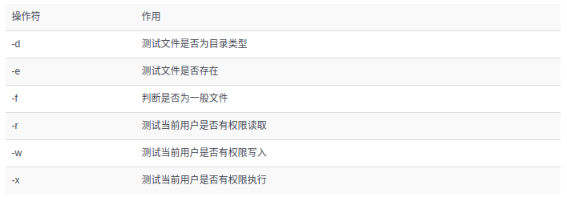

<mark>the unix philosophy is **Small is beautiful** or **less is more**</mark>

1. 为什么会有逻辑卷管理器(logical volume manager)?

2. __/__ 和 __?__ 分别是正向搜索和反向搜索.

3. top命令:  

4. ifconfig 和 Windows的 ipconfig 一样.

5. uname => knel and linux version.

6. free 内存使用量

7. who 接入用户都是谁

8. history 历史上使用的命令
     可用 !行号 来执行该行号的命令

9. cat 查看文件内容,适合较少内容的
10. more 查看文件内容,适合较多内容的
11. head -n ... 查看文件头几行的内容
12. tail -n ... 查看文件后几行的内容

13. stat 查看文件的相关信息 

14. 在文件的每行截取指定字符, 通过 -b/-c/-f.其实看去来没什么用但是'存在即是真理'. 比如: 截取passw文件的第一个用户, 用cut就特别方便.  
  
  

15. diff 查看文件的不同, 单单是查看的方式就有三种: diff file1 file2 | diff -c file1 file2 | diff -u file1 file2 (当然是合并版最好,'git' 就采取了这种方式)  
  
'+' and '-' 都是对应改变, 但是'-' 对应的是第一个文件, 而加对应的是第二个文件的改变, 或许仅仅是一个字不同而已,并不是代表就是加一行或者减一行.  

16. mkdir -p .... 可创建层叠文件夹  

17. dd 按照指定大小和个数的数据块来复制文件或者转换文件  
  
  

18. tar -xzvf ... -C ....
      解压(为gzip),过程,源文件,目标地址
    tar -czvf ... -C ....
      压缩(为gzip),过程,源文件,目标地址

19. /etc/passwd 保存着所有用户信息

20. grep 查询字符 被查询文件 
      -n 这个是显示字符所在的行数  
      -v 参数是那么代表反选  
      -c 显示符合的行数(列数)  
      -E "..." 使用正则  
      -r 可对目录使用递归  
      -q 成功搜索到输出 '0' or if will return not zero value when it failed  
      -A number, means print the content of numberth lines behind the fit line.  
      -B number, 意味着打印符合条件的当前行前number行的内容.  
      -C number, 前后行  

21. find 文件 'linux中可是一切都是文件哦'.  
  
> 其实一开始我是搞不清`whereis` and `which` has what differences. but now i understand it. Yep, it have something same and also have some differences.
>> 1 `whereis` 是仅仅用于程序名(有些程序名也是命令)的搜索, 而且搜索三种类型的文件, -m(man instruction) -b(the binary file) -s(the source code)  
>> 2 `which` 是仅仅搜索命令的, 但是他只返回搜索结果的第一个.  

 所以啊, 经过以上的解析就让我们开始进入 <mark>find</mark> 的世界吧:  
 **find 'diretory' 'condition' 'motion'**  
 _(if we dont' aim the special directory, by default, the command will use the current directory and it's subset)_  
> 1 **-name "file"**, means what format files we want to find. __eg: find . -name "*.txt"__  

> 2 **!** , means find file not in this condition. __eg: find . ! -name "*.txt"__  

> 3 **-o** , means we execute the other command in the same time. __eg: find . -name "*.txt" -o -name "*.pdf"__  

> 4 **-regex** , means using regex to find file. __eg: find . -regex ".*\(\.txt\|\.pdf\)$"__  

> 5 **-type ...(f, d, l, c, b, s, p)**, means find what type of file we want to find. __eg: find . -type f -name "*.txt"__  

> 6 **-atime/-amin**, means the user last acess time, __eg:__  
>> 1 **find . -type f -atime -7**, the __-__ sign means among this number's day.  
>> 2 **find . -type f -atime 7**, no sign before number means just before this number's day.  
>> 3 **find . -type f -atime +7**, the __+__ sign means beyond this number's day.  

> 7 **-mtime/-ammin**, means the user last modify the file's content.  

> 8 **-ctime/-cmin**, means the user last chage the file's satation.  

>   

> 10 **-delete** , means delete the file meatched. __eg: find . -type f "*.txt" -delete__  

> 11 **-perm(-permission)**, means find the file accoding to it's access. __eg: find . -type f -type f -name "*.txt" -perm 777__  

> 12 **-user/-group**, means find the file owned of which user or group. __eg: find . -type f -user tom / find . -type f -group sunk__  

> 13 **-path ".." -prune**, means find some file but prune this directory. __eg: find . -pat "./sk" -prune -o -type f -name "*.txt"__  

> 14 **-exec ... {} \;** , note that every charatcer in sign of '**' is should be need, the '{}' actually is the form parameter which present every files of matched, and '\' and ';' are neccesary for it. This command can execute somet motion after find the matched files. <mark>eg:</mark> find . -name "*.txt" -exec rm {} \;.  **Actually, we can use <mark>-ok </mark> to replace it beacuse it will show the prompt which show more security.**  

----------------------------------------------

<mark>NOTE:</mark> 我们知道 linux命令可以从两个地方读取要处理的内容, 一个是通过命令行**参数**, 另一个是标准输入.  
_eg:_ `echo 'main' | cat test.cpp`  _result:_ show the content of test.cpp, if no exit this file, it also can't show the 'main'. 正常来讲, `echo 'mina'` 会通过管道符 将其的**标准输出** 导入到 cat 的**标准输入**中, 也就是说,此时 cat 的标准输入中是有内容的. 但是他却不从标准输入中读入要处理的内容, 因为他优先从命令行参数中读取数据, 而且有一些命令他是不处理**标准输入**的. _eg_: `echo '516' | kill`. 这个是不能执行的.  
那么就引申到这个可以 **把文件内容分割为命令行参数的命令**: <mark>xargs</mark>  
> 有时候我们的脚本却需要 echo '516' | kill 这样的效果，例如 **ps -ef | grep 'ddd' | kill** 这样的效果，筛选出符合某条件的进程pid然后结束。这种需求对于我们来说是理所当然而且是很常见的，那么应该怎样达到这样的效果呢。有几个解决办法：  
> 1 通过 **kill \`ps -ef | grep 'ddd'\`**    
> 这种形式，这个时候实际上等同于拼接字符串得到的命令，其效果类似于  kill $pid
>
> 2 **for procid in $(ps -aux | grep "some search" | awk '{print $2}'); do kill -9 $procid; done**   
> 其实与第一种原理一样，只不过需要多次kill的时候是循环处理的，每次处理一个
>
> 3 <mark>**ps -ef | grep 'ddd' | xargs kill**</mark>  
> OK，使用了xargs命令，铺垫了这么久终于铺到了主题上。**xargs命令可以通过管道接受字符串，并将接收到的字符串通过空格分割成许多参数(默认情况下是通过空格分割) 然后将参数传递给其后面的命令，作为后面命令的命令行参数**  

所以, 一切大白, 我们要学习的一个命令是 <mark>xargs</mark>  
xargs命令是给其他命令传递参数的一个过滤器，也是组合多个命令的一个工具。它擅长将标准输入数据转换成命令行参数，xargs能够处理管道或者stdin并将其转换成特定命令的命令参数.  
  
这里值得注意的是, xargs 必须和其他命令一起执行的, 因为他的作用就是为了使其他东西转换成命令行参数, xargs 是要放在需要参数的命令行前面.  
这里有一个和 find 命令里面的一个 **-exec**, 有点类似的地方, 就是 **对应替换** `{}`, 但是我们另外增加一个 `I` 和 减少一个 `;`.  
1 _eg:_ **`ls *.jpg | xargs -n1 I cp {} /data/images`**  
2 _eg:_ 用rm 删除太多的文件时候，可能得到一个错误信息：/bin/rm Argument list too long. 用xargs去避免这个问题：  
  **`find . -type f -name "*.log" -print0 | xargs -0 rm -f` => `find . -type f -name "*.log" | xargs -n1 I rm -f {}`**  
  

----------------------------------------------

22. pidof name 查找改该进程的id

23. kill id 结束进程

24. <mark>每个基于文本的程序都应该能够从**任何源**接受输入,并向任何**目标**写入输出</mark> 
> 以这种方式处理I/O, 用户具有极大的灵活性,而且对于Linux来说, 他把处理输入和输出交给了Unix来处理, 这就意味着用户不必担心输入和输出的各种情况了. 所以,Unix的开发人员设计了一种读取数据和两种写出数据的通用方法. 在登录时, shell会自动地将标准输入设置成键盘(或许你可以这样想,除了从指定文件读入外,其他的都可以不是标准输入)将标准输出和标准错误设置为屏幕.  

输入重定向: 把文件导入命令(一般是直接在命令后面跟文件)[多用于组合命令中]( "<"  就如C++ 一样的输入方向)  
输出重定向: 把原本输出屏幕的数据信息写入到指定文件中显示  
  
  
  
<mark>note:</mark>  
1.因为当重定向输出时, 如果如果 一不小心 '>' 覆盖了原本的内容, 那么就糟糕了,所以我们可以做一些防护措施: 对于Bash CLI 来说, 是这样 `set -o noclobber`, 然后, 当确定要重定向时, 使用 '>|'.  
2.'>' 和 '<', 可以一并使用:    
  

25.  

26. alias :创建属于自己的命令别名
      比如: alias rm='rm -i' 解决了困扰我多年的rm 不小心操作后的问题.
note: PATH变量的作用是, 设定解析器搜索所执行命令的路径.

27. env :查看我们的环境变量(有时候, 环境标量仅仅是指PATH, 这个可以在任何位置启动程序的变量,里面写着各种程序的执行路径)  
      
    

28. | : 管道符把左面（前面）命令的输出值作为右面（后面）命令的输入值以便进一步处理信息。
    
29. lsb_release -a :查看Linux是那个系统

30.   
      
    
**NOTE:** 
 1. 参数如同上面所示,通过空格来隔开.  
 2. 如果通过输入完整路径来运行脚本的话,那么大多数会显示权限不足,此时需要增加权限. 比如:  
  

31. shell 脚本的测试语句和之前接触的有些不同,他是这样的: [ 条件表达式 ] _条件表达式左右都需应有一个空格, 其实shell是一种严格按照规范的语言_  
**NOTE:**
 1. 按照测试对象来划分,条件测试语句可以分4种:  
> - 文件测试语句
> - 逻辑测试语句
> - 整数值比较语句
> - 字符串比较语句  
>> 1.  
>> 2.  
>> 3.  
>> 4.  
 2. **$?** 可以显示上一条命令执行后的返回值, 其实如果在脚本中,那么上一条语句执行过后,那么它也就可以说是上一条命令了.
 3. shell 脚本中的条件测试语句, 如果成功那么它返回的值是 **0**, failed, 则返回其他任何值.

32. shell 脚本的流程控制语句:  
> 1.   
>>     
> 2.   
> 3.   
> 4.   
> 5.   
>>   while循环语句的条件和for的不一样, for的往往是已经知道循环次数了,而while并不确定, 简单来说就是for 的 使用情景更加具体.
> 6.   
> 7.   
> 8.  

<mark>NOTE:</mark>  
- shell 脚本只需要对变量名全大写就行了, 而不需要一个定义符  
- shell 脚本不需要对在结尾对语句进行 ';'
- shell 中, $(...) 和 `...` 是一样的.
- shell 中, /dev/null 是个信息黑洞,相当与'回收站'

33. linux中的用户:
> 1. 管理员: Linux的管理员是 root, 为什么是 root呢? 是因为管理员的UID=0, 而不是因为他叫root, root只是一个名称而已.  
> 2. 系统用户: UID为1~999, 为什么会有那么多呢? linux系统为了防止某个服务程序出现漏洞而被黑客提权到整个服务器,**默认服务程序会有独立的系统用户负责运行,进而有效控制破坏的范围**  
> 3. 普通用户: UID从1000开始! 其是由管理员创建的用于日常工作的用户  
**NOTE:** UID->User Identification, 具有唯一性.  

34. 为了方便管理一组用户, Linux 引入了用户组的概念. 通过使用GID(Group Identification) 用户组号码,把多个用户加入到同一个组中, 从而方便组中用户的统一规划权限或指定任务. 
**NOTE:** Linux 在创建每个用户时, 都会自动创建一个同名的用户组, 而且这个基本用户组就只有该用户一个人. 如果该用户被以后纳入其它用户组, 则这个其它用户组被称为扩展用户组. 一个用户只有一个基本用户组, 而可以有多个扩展用户组.  

35.   
需要注意的是其中 `-e` and `-s` which one is expried-time and the other is shell explainer.  

36.   
其中, 需要注意的是'一切皆是文件', 所以添加用户实际上就是修改配置文件的过程. 用户信息都保存在 /etc/passwd 中, 不要单单认为他是'密码' :).  
      

37.   
需要注意的是, 我们可以利用 `-l` and `-u` to lock and unlock the user.  

38.   
需要注意的是, 在生产环境中单纯的设置文件的**rwx** 权限是无法满足安全性和灵活性的要求, 所以便有了 **suid, sgui, sbit**这样的特殊权限位.如果有了这个权限, 会增加一个**s**, 而且这个仅仅是对**二进制文件**有效.  

      
      
Here, we should note that, the first usage of sguid is we can give the user who is executing this file an access of the file's owner. 但是第二个作用似乎更常用些, 我们设置一个共享组目录, 而组内任何人员创建的文件都不会归他自己的用户组了而是现在这个共享组.  

39.   
需要注意, **sbit** 特殊权限是为了不让共享目录内的文件被恶意删除(一个文件能否被删除, 不是看他自己的权限而是看他所在目录的权限), 如果一个目录被设置成了**sbit**, 那么我们可以通过 `ls -l` 看到权限里面有个 **t/T**. 我们可以通过 `chmod -R o+t` 来设置'sbit', 这个 'R' 是代表递归的意思.   

40.   
    **chmod 'who'+'what access'**  

41.   

42.   
      
   我觉得这是一个非常重要的且cool的命令, 如果用 `ls` 命令是看不出隐藏的权限的, 所以我们可以用 `lsattr` 来查看命令  

      

43.   
      
      
      
需要注意, 我们为什么需要 **setfacl**, 明明都有了 **chmod and chattr**, 问得好! **存在即合理**, 我们的确有了前两个命令可以做大部分工作了, 但是 就如社会发展到现在, 越来越多的**定制化**. 其实类比这个, **setfacl** 就是定制化: 比如, 你想把某个文件仅仅是设置成你和你的一个好友看, 你用上面的两个命令是做不到的. 想想,是不是真的做不到? 因为权限只有两个有, 而上面的命令权限设置, 只有是用户一个人的, 而其他的是则是 用户组 和 其他人, 如果我们给其他人设置了, 那么是这个其他人是不仅仅只有 你的好友一个人. 所以就有了 `setfacl` 的出现.  
**规则:**  
1 模板 => **`user:who(if no specify this will be nothing):permission`** eg: `_user::rwx_`. 接下来的 **group, mask, other** 都是这种套路.  
2 ACL_USER_OBJ and ACL_GROUP_OBJ are both point that the owner not the other user and group, the ACL_USER and ACL_GROUP even point that. 现在我们还要知道 **MASK** 代表遮盖, 这个代表了 当前用户,当前用户组和 其他用户的**最大值**, 注意了是最大值, 就是表明不一定是这个值, 他原本是什么的值就是什么值, 只不过这个 MASK 出来了有点 **蒙蔽** 的意思, 所以我们要想知道确切是什么值, 就必须用 `getfacl` 来查看. 注意有 ACL 设置的, 在 `ls -l` 结果后面会有一个 **+**.  

<mark>**特殊权限, 隐藏权限, 权限表的差异**</mark>  
> 1 特殊权限, 是仅仅针对二进制文件, 其中的 SGUID and SBIT 可以针对目录, 作用是: 可以给每个用户,或者某个组 暂时拥有 管理员的权限, 他主要针对的是用户而不是文件,当然他的设置是在文件上. 用法: **`chmod who+s file`** **`chomod who+t file`** and **SUID:4 SGID:2 SBIT:1**  
> 2 隐藏权限, 可以对文件,目录进行隐秘的设置, 比如不能修改内容;只能追加内容: 删除文件后还有备份; 他这个不同 特殊权限, 是针对的是文件而不是用户. 用法: **`chattr +/- parameter file`**  
> 3 权限表, 我的感觉是这个是针对 特殊权限的improved version, 因为他把把单独一个用户领出来, 而不是只能对所有用户. 用法: **`setfacl user/group/mask:special point:permission`**  

44.  
      
      
      
> 其实, 这个拓展分区是其中一个主分区, 为了拓展而成的拓展分区:).  
> 再次, 我们需要弄清两个概念, 一是 **sda** 中的 `a` 不是所谓的第一个插槽上的存储储备, 这里的 a 是由系统内核识别的顺序决定的. 比如, 你插在第二个插槽, 这里也是 sda. 二是, **sda1** 中的 `1` 不一定是第一个分区, 因为这也可以是自己分配的.  

      
      
      

