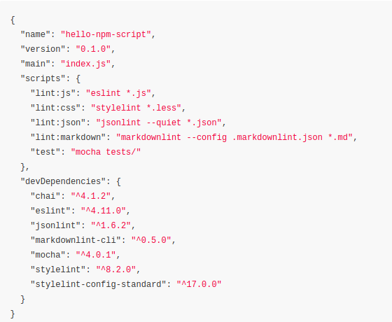
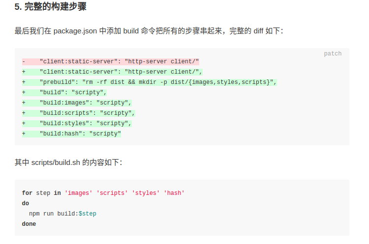

### <mark>npm script</mark> automaking Frontend workflow

> In this concept, the core is **npm** and in npm the core is **pakage.json** file, and in package.json file, the core are **dependencies** and **script**. But what we do are **mainly sorounding the script**   

-------------------------------------------------------------------------

1 First, we using **npm** to initial current project. eg: `npm init`  
> becasue we need to manage the package(function module) what we need in our project.  

2 second, we know from above sentences **using script** is the most important thing we should learn about this mehod **automaking the Front-end workflow**. So, _**how to using** the script to run the package to build our workflow?_

3 We can using the following command to run script: **`npm run "name"`**
> because the script contain the command which can run the package  

eg: `npm run eslint`>  
> why we can directally run the packages' commands, becuse we put their path(./node_modules/.bin/...) in front of the $PATH automatally.  

-------------------------------------------------------------------------

4 Then, we know that we actually **using the npm script to integrate the pakage to make us easily control them** so that we can <mark>build</mark> the automaking front-end work flow.

-------------------------------------------------------------------------

5 So we know the principle about this method, why not add  these fucking required pakages right now!!   

-------------------------------------------------------------------------

6 first, the style linters for all kinds of our files in our project. Commonly, in web Front-end project, it needs **eslint** checking javascript [usage](https://eslint.org/docs/user-guide/command-line-interface), **stylelint** checking css, less, scss [usage](https://stylelint.io/user-guide/cli/), **jsonlint** checking json [usage](https://github.com/zaach/jsonlint), **markdownlint-cli** checking markdown, and the html linter but it hasn't a good inplement yet. And we maybe need a test for code, so we can add **mocha** [usage](https://mochajs.org/#usage) testing the target code and collecting the test's result, and the **chai** the test assertion library. <mark>还不知道如何使用</mark>.   
eg:   

<mark>Note:</mark> `*` means any filename; `**` means any floor sonDictionary, but if we write shell scipt directly. we should transfer it using `\*`  

-------------------------------------------------------------------------

7 we can using `&&` to make the npm's commands run in orderly, but if one of them has problems, the other behind it will stop!! so we often use **parallel model** which using `&` to combind the commands. But sometimes one of them will costs more time than other, in order to solve it we can add `& wait` in the last, so we can using `Ctrl+c` to stop it.   

eg: `npm run lint:js & npm run lint:css & npm run lint:json & npm run lint:markdown & mocha tests/ & wait`

8 if we wanna to test the project, we can `npm run test(-s/-d)` and the simple way: `npm t(-s/-d)`.   

9 And we can use `npm-run-all`<small>(first, we should install it)</small>, which can match the wildcard so it can reduce much works, and it containt the `& wait` function, so we don't need to add it. For exmaple: `"test": "npm-run-all --parallel lint:* mocha"` 

-------------------------------------------------------------------------

10 We can add the argument to the indirectives but should add `--` in front it. For example: ` "lint:js:fix": "npm run lint:js -- --fix"`  

11 If we want add some comment to the whole process, we can do this: `"test": "# 运行所有代码检查和单元测试 \n    npm-run-all --parallel lint:* mocha"` <small>Beacuse the the test process is the last one step</small>

-------------------------------------------------------------------------

12 The **npm** give it a **life cycle** which I call it **order process**.It can control the commands run period: `precommand`, `command`, `postcommand`. For example: the **test** step is the important process in our whole process, so we give the test three period which are accodringly `pretest`, `test`, `posttest`, so we can do this:  
  

In test, we should collect our test' result, so we should add some package, here we use **nyc** [usage](https://github.com/istanbuljs/nyc) which collect the **cover's rate** and **opn-cli** [usage](https://github.com/sindresorhus/opn-cli) which can open any program, but here we use it to open browser. Install: `npm i nyc opn-cli -D`. And the nyc can also make the three period like:  
  
  

-------------------------------------------------------------------------

13 In npm script, we can use the **variable**, we can use this command to see what we have now `npm run env | grep npm_package | sort` which are predefined variables. And if we want to use the variable, we must add a `$` in front it, becasue we run the command on shell, why use varaible, because we don't write the more codes.  
  
> we can see the variable's name are defined follow by `""`.  

14 Now, we will improve our **cover** step, we should archive the test's results, so we edit like:  

```json
"scripts": {
   "cover": "nyc --reporter=html npm test",
   "cover:cleanup": "rm -rf coverage && rm -rf .nyc_output",
   "cover:archive": "mkdir -p coverage_archive/$npm_package_version && cp -r coverage/* coverage_archive/$npm_package_version",
   "postcover": "npm run cover:archive && npm run cover:cleanup && opn coverage_archive/$npm_package_version/index.html"
}
```

  

And we can open with localhost which can sent our test's result for our workmates, so we can install the package first `npm i http-server -D` [usage](https://www.npmjs.com/package/http-server) then edit the file:

```json
"config": {
  "port": 3000
},
```

```json
"cover:serve": "http-server coverage_archive/$npm_package_version -p $npm_package_config_port",
"cover:open": "opn http://localhost:$npm_package_config_port",
"postcover": "npm-run-all cover:archive cover:cleanup --parallel cover:serve cover:open"
```
  

-------------------------------------------------------------------------

15 In above, we use npm-run-all to ruduce the more command combind, but now, we have also a lot of similar scripts. So we can add this package: **scripty** [usage](https://github.com/testdouble/scripty) to put script into singl file so that reduce the complexity. For example:
  
<mark>Because we create shell file so we must add execute permission to it</mark>: `chmod -R a+x scripts/**/*.sh`  
  
  
  

-------------------------------------------------------------------------

16 If we wanna to make a automaking in a deep degreee, why not watch the change all time? In our setting, only **mocha** support the `--watch` flag, all the style linter haven't not yet, so we can use package: **onchange** [usage](https://github.com/Qard/onchange), look:   

17 We **watch** the change, then we add refresh automatically, add the package **livereload** [usage](https://www.npmjs.com/package/livereload)<small>we should add a script in html so we can get it's good</small>.  
  
  

-------------------------------------------------------------------------

18 The most important thing before we finish the project:
  
  
  
  
  
  
  
  
  

Last, we can see the wheater the result is right? `http-server dist`  
[imagemin_usage](https://github.com/imagemin/imagemin-cli) / [cssmin](https://www.npmjs.com/package/cssmin) / [uglify-es](https://github.com/mishoo/UglifyJS2/tree/harmony) / [hashmark](https://github.com/keithamus/hashmark) / [replaceinfiles](https://github.com/songkick/replaceinfiles)


