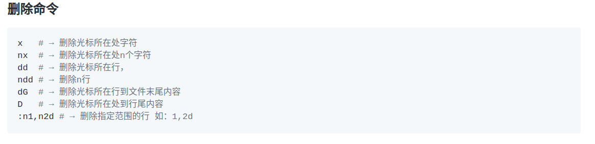

1 这个命令是个神奇的命令(#_#)<mark>`<c-:>`</mark>, 居然可以令外部的copy内容粘贴到vim中, 也可以是粘到命令行中, 但是如果是中文的话, 那就粘不到命令行中.  

-------------------------

2 If we want to fullscreen current buffer, we can use `==<leader>z==`.  

------------------------

3 If we wanna fold the code of function, we could use `==<leader>zz==`.  
  but we can also use `<z-c>` and `<z-o>` to fold and oepn.  

-----------------------

4 
